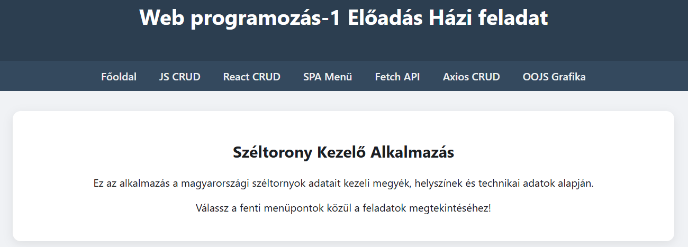

# Széltorony Kezelő Alkalmazás

## Web programozás-1 Előadás Házi Feladat Dokumentáció

**Készítették:** LIUNJT, M3BHZP  
**Dátum:** 2025/2026. tanév

---

## Tartalomjegyzék

| # | Fejezet | Leírás |
|---|---------|--------|
| 1 | [Bevezetés](docs/01-bevezetes.md) | Az alkalmazás célja, fejlesztők, URL-ek |
| 2 | [JavaScript CRUD](docs/02-js-crud.md) | Tömb alapú adatkezelés JavaScript-tel |
| 3 | [React CRUD](docs/03-react-crud.md) | React State alapú adatkezelés |
| 4 | [SPA - Single Page Application](docs/04-spa.md) | Tic-Tac-Toe és Számológép |
| 5 | [Fetch API](docs/05-fetchapi.md) | Szerveres CRUD műveletek |
| 6 | [Backend és Adatbázis](docs/06-backend.md) | PHP REST API, MySQL |
| 7 | [Technikai Adatok](docs/07-technikai-adatok.md) | Hozzáférések, credentials |
| 8 | [Axios CRUD](docs/08-axios.md) | React + Axios HTTP kliens |
| 9 | [OOJS Animáció](docs/09-oojs.md) | Objektumorientált JavaScript |

---

## Gyors áttekintés

### Az alkalmazásról

A **Széltorony Kezelő Alkalmazás** egy webes alkalmazás, amely a magyarországi széltornyok adatainak kezelésére szolgál. Az alkalmazás különböző technológiákkal valósítja meg a CRUD (Create, Read, Update, Delete) műveleteket.

### Főoldal képernyőkép



### Főbb funkciók

| Funkció | Technológia | Oldal |
|---------|-------------|-------|
| Tömb alapú CRUD | Vanilla JavaScript | [javascript.html](javascript.html) |
| State alapú CRUD | React + useState | [react.html](react.html) |
| SPA (Játékok) | React Components | [spa.html](spa.html) |
| Szerveres CRUD | Fetch API + PHP | [fetchapi.html](fetchapi.html) |
| HTTP kliens | React + Axios | [axios.html](axios.html) |
| OOP Animáció | ES6 Classes | [oojs.html](oojs.html) |

---

## Weboldal URL-ek

| Leírás | URL |
|--------|-----|
| **Éles weboldal** | http://liunjtm3bhzp.nhely.hu |
| **GitHub repository** | *[Add meg a GitHub URL-t]* |

---

## Projekt struktúra

```
webprog_eloadas-main/
├── 📄 index.html           # Főoldal
├── 📄 javascript.html      # JS CRUD oldal
├── 📄 react.html           # React CRUD oldal
├── 📄 spa.html             # SPA oldal
├── 📄 fetchapi.html        # Fetch API oldal
├── 📄 axios.html           # Axios CRUD oldal
├── 📄 oojs.html            # OOJS animáció
├── 📄 style.css            # Stílusok
├── 📄 layout.js            # Közös layout
│
├── 📁 backend/             # Szerveroldal
│   ├── api.php             # REST API
│   ├── config.php          # DB konfig
│   └── db.php              # PDO kapcsolat
│
├── 📁 src/                 # React forráskód
│   ├── App.jsx             # CRUD komponens
│   ├── SpaApp.jsx          # SPA komponens
│   ├── AxiosApp.jsx        # Axios CRUD komponens
│   └── components/         # Játék komponensek
│
└── 📁 docs/                # Dokumentáció
    ├── 01-bevezetes.md
    ├── 02-js-crud.md
    ├── 03-react-crud.md
    ├── 04-spa.md
    ├── 05-fetchapi.md
    ├── 06-backend.md
    ├── 07-technikai-adatok.md
    ├── 08-axios.md
    └── 09-oojs.md
```

---

## Feladatpontok megvalósítása

A dokumentáció részletesen bemutatja az egyes feladatpontok megvalósítását. Az alábbi táblázat összefoglalja, hol található az egyes funkciók leírása:

| Feladatpont | Dokumentáció | Implementáció |
|-------------|--------------|---------------|
| Tömb alapú JS CRUD | [02-js-crud.md](docs/02-js-crud.md) | javascript.html |
| React State CRUD | [03-react-crud.md](docs/03-react-crud.md) | react.html, src/App.jsx |
| SPA alkalmazás | [04-spa.md](docs/04-spa.md) | spa.html, src/SpaApp.jsx |
| Fetch API | [05-fetchapi.md](docs/05-fetchapi.md) | fetchapi.html |
| PHP Backend | [06-backend.md](docs/06-backend.md) | backend/api.php |
| Adatbázis | [06-backend.md](docs/06-backend.md) | backend/db.php |
| Axios HTTP kliens | [08-axios.md](docs/08-axios.md) | axios.html, src/AxiosApp.jsx |
| OOJS Animáció | [09-oojs.md](docs/09-oojs.md) | oojs.html |
| Hozzáférési adatok | [07-technikai-adatok.md](docs/07-technikai-adatok.md) | - |

---

## Technikai információk

A részletes technikai adatok (FTP, adatbázis hozzáférés, jelszavak) a [Technikai Adatok](docs/07-technikai-adatok.md) oldalon találhatók.

### Használt technológiák

- **Frontend:** HTML5, CSS3, JavaScript (ES6+), React 18, Axios
- **Backend:** PHP 7.4+, PDO
- **Adatbázis:** MySQL 5.7+
- **Build tool:** Vite
- **Hosting:** nhely.hu

---

## Képernyőképek helye

A dokumentációban jelölt screenshot helyekre a következő képeket kell készíteni:

1. `docs/screenshots/fooldal.png` - Főoldal
2. `docs/screenshots/js-crud-*.png` - JS CRUD funkciók
3. `docs/screenshots/react-crud-*.png` - React CRUD funkciók
4. `docs/screenshots/spa-*.png` - SPA játékok
5. `docs/screenshots/fetchapi-*.png` - Fetch API funkciók
6. `docs/screenshots/axios-*.png` - Axios CRUD funkciók
7. `docs/screenshots/oojs-*.png` - OOJS animáció
8. `docs/screenshots/phpmyadmin-*.png` - Adatbázis képek
9. `docs/screenshots/vscode-projekt.png` - Projekt struktúra

---

## Kapcsolat

**Neptun kódok:** LIUNJT, M3BHZP

---

*Dokumentáció készült: Web programozás-1 Előadás házi feladathoz*