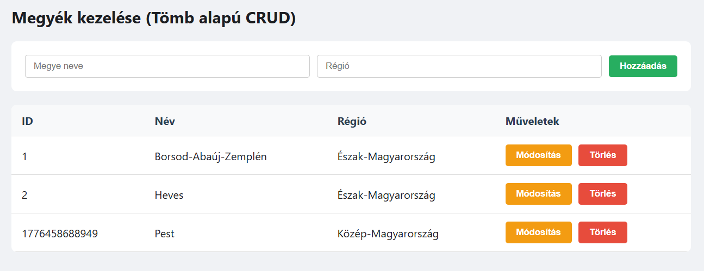
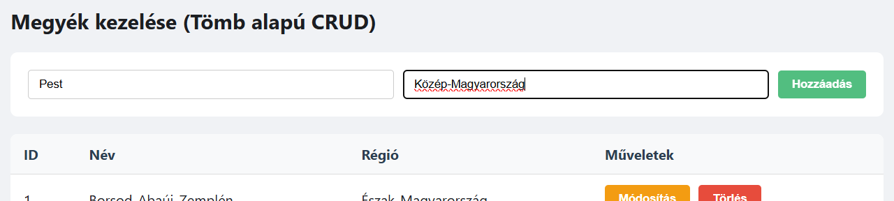
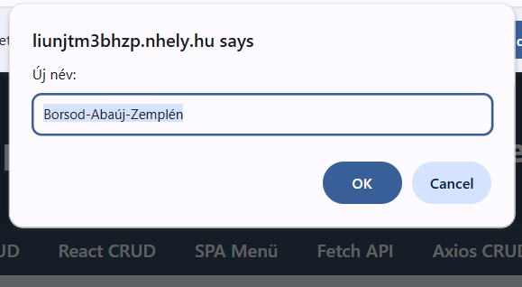
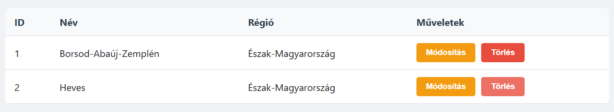

# 2. JavaScript CRUD (Tömb alapú adatkezelés)

## 2.1 Feladat leírása

Ez az oldal tisztán JavaScript alapú CRUD (Create, Read, Update, Delete) műveleteket valósít meg, tömb adatszerkezet használatával. Az adatok nem perzisztensek - az oldal újratöltésekor visszaállnak az alapértelmezett értékekre.

## 2.2 Megvalósítás helye

- **Fájl:** `javascript.html`
- **Elérhető URL:** http://liunjtm3bhzp.nhely.hu/javascript.html

## 2.3 Funkciók

### 2.3.1 Adatszerkezet

A megyék adatai egy JavaScript tömbben tárolódnak:

```javascript
let adatok = [
    {id: 1, nev: "Borsod-Abaúj-Zemplén", regio: "Észak-Magyarország"},
    {id: 2, nev: "Heves", regio: "Észak-Magyarország"}
];
```

### 2.3.2 Create (Létrehozás)

Új megye hozzáadása a `hozzaad()` függvénnyel:

```javascript
function hozzaad() {
    const n = document.getElementById('mNev').value;
    const r = document.getElementById('mReg').value;
    if (!n || !r) return alert("Töltsd ki!");
    adatok.push({id: Date.now(), nev: n, regio: r});
    frissit();
}
```

**Működés:**
- Beolvassa a megye nevét és régióját az input mezőkből
- Validálja, hogy mindkét mező ki legyen töltve
- Új egyedi ID-t generál a `Date.now()` segítségével
- Hozzáadja az új elemet a tömbhöz
- Frissíti a megjelenítést

### 2.3.3 Read (Olvasás/Megjelenítés)

A `frissit()` függvény rendereli az adatokat táblázatba:

```javascript
function frissit() {
    const tbody = document.getElementById('lista');
    tbody.innerHTML = adatok.map((m, i) => `
        <tr>
            <td>${m.id}</td><td>${m.nev}</td><td>${m.regio}</td>
            <td>
                <button class="edit" onclick="szerkeszt(${i})">Módosítás</button>
                <button class="delete" onclick="torol(${i})">Törlés</button>
            </td>
        </tr>
    `).join('');
}
```

### 2.3.4 Update (Módosítás)

A `szerkeszt()` függvény prompt ablakokkal kéri be az új adatokat:

```javascript
function szerkeszt(i) {
    const n = prompt("Új név:", adatok[i].nev);
    const r = prompt("Új régió:", adatok[i].regio);
    if (n && r) {adatok[i].nev = n; adatok[i].regio = r; frissit();}
}
```

### 2.3.5 Delete (Törlés)

A `torol()` függvény eltávolítja az elemet a tömbből:

```javascript
function torol(i) {
    adatok.splice(i, 1); 
    frissit();
}
```

## 2.4 Képernyőképek

### 2.4.1 JavaScript CRUD oldal



### 2.4.2 Új elem hozzáadása



### 2.4.3 Elem módosítása



### 2.4.4 Elem törlése után



## 2.5 UI elemek

| Elem | Típus | Funkció |
|------|-------|---------|
| Megye neve | `<input type="text">` | Megye nevének bevitele |
| Régió | `<input type="text">` | Régió nevének bevitele |
| Hozzáadás | `<button class="add">` | Új elem létrehozása |
| Módosítás | `<button class="edit">` | Meglévő elem szerkesztése |
| Törlés | `<button class="delete">` | Elem eltávolítása |

---

[← Bevezetés](01-bevezetes.md) | [Vissza a főoldalra](../README.md) | [Következő: React CRUD →](03-react-crud.md)
