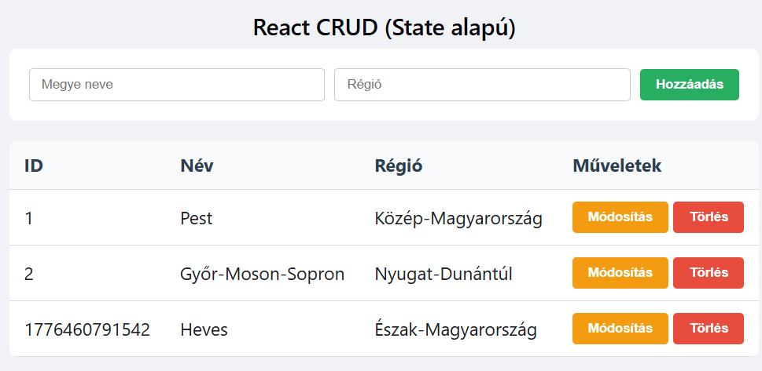
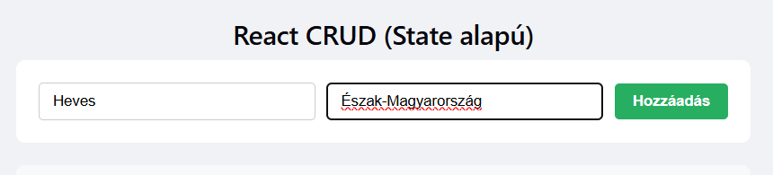
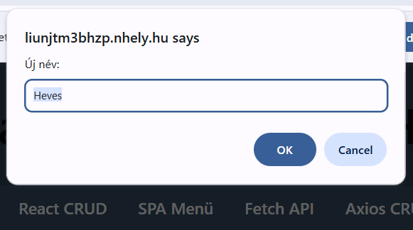

# 3. React CRUD (State alapú adatkezelés)

## 3.1 Feladat leírása

Ez az oldal React komponens alapú CRUD műveleteket valósít meg, a React `useState` hook segítségével. A state menedzsment biztosítja az automatikus újrarenderelést az adatok változásakor.

## 3.2 Megvalósítás helye

- **Fájl:** `react.html` és `src/App.jsx`
- **Elérhető URL:** http://liunjtm3bhzp.nhely.hu/react.html

## 3.3 React projekt struktúra

```
src/
├── App.jsx           # Fő CRUD komponens
├── main.jsx          # React belépési pont
├── App.css           # Komponens stílusok
└── index.css         # Globális stílusok
```

## 3.4 Funkciók

### 3.4.1 State kezelés

A komponens React useState hook-ot használ az adatok és input értékek tárolására:

```jsx
const [megyek, setMegyek] = useState([
    { id: 1, nev: "Pest", regio: "Közép-Magyarország" },
    { id: 2, nev: "Győr-Moson-Sopron", regio: "Nyugat-Dunántúl" },
]);
const [ujNev, setUjNev] = useState("");
const [ujRegio, setUjRegio] = useState("");
```

### 3.4.2 Create (Létrehozás)

```jsx
const hozzaad = () => {
    if (!ujNev || !ujRegio) return;
    setMegyek([...megyek, { id: Date.now(), nev: ujNev, regio: ujRegio }]);
    setUjNev("");
    setUjRegio("");
};
```

**Működés:**
- Spread operátorral (`...megyek`) másolja a meglévő tömböt
- Hozzáfűzi az új elemet
- Üríti az input mezőket a state frissítésével

### 3.4.3 Read (Olvasás/Megjelenítés)

A JSX-ben a `map()` függvénnyel rendereli az elemeket:

```jsx
<tbody>
    {megyek.map((m) => (
        <tr key={m.id}>
            <td>{m.id}</td>
            <td>{m.nev}</td>
            <td>{m.regio}</td>
            <td>
                <button className="edit" onClick={() => szerkeszt(m.id)}>
                    Módosítás
                </button>
                <button className="delete" onClick={() => torol(m.id)}>
                    Törlés
                </button>
            </td>
        </tr>
    ))}
</tbody>
```

### 3.4.4 Update (Módosítás)

```jsx
const szerkeszt = (id) => {
    const m = megyek.find((x) => x.id === id);
    const n = prompt("Új név:", m.nev);
    const r = prompt("Új régió:", m.regio);
    if (n && r) {
        setMegyek(
            megyek.map((x) => (x.id === id ? { ...x, nev: n, regio: r } : x)),
        );
    }
};
```

**Működés:**
- Megkeresi az elemet ID alapján
- Prompt ablakokkal kéri be az új értékeket
- A `map()` és spread operátorral frissíti az adott elemet

### 3.4.5 Delete (Törlés)

```jsx
const torol = (id) => setMegyek(megyek.filter((m) => m.id !== id));
```

**Működés:**
- A `filter()` segítségével visszaadja az összes elemet, kivéve a törölni kívánt ID-jút

## 3.5 Controlled Components

Az input mezők "controlled component" mintát követnek:

```jsx
<input
    value={ujNev}
    onChange={(e) => setUjNev(e.target.value)}
    placeholder="Megye neve"
/>
```

Ez biztosítja, hogy az input értéke mindig szinkronban legyen a React state-tel.

## 3.6 Képernyőképek

### 3.6.1 React CRUD oldal



### 3.6.2 Új elem hozzáadása Reactben



### 3.6.3 Módosítás prompt ablak



## 3.7 Különbségek a JS CRUD-hoz képest

| Aspektus | JavaScript CRUD | React CRUD |
|----------|-----------------|------------|
| Adattárolás | Globális tömb | useState hook |
| DOM frissítés | Manuális innerHTML | Automatikus re-render |
| Input kezelés | getElementById | Controlled components |
| Kód szervezés | Script tag | JSX komponens |
| Újrafelhasználhatóság | Alacsony | Komponens újrahasználható |

---

[← JS CRUD](02-js-crud.md) | [Vissza a főoldalra](../README.md) | [Következő: SPA →](04-spa.md)
