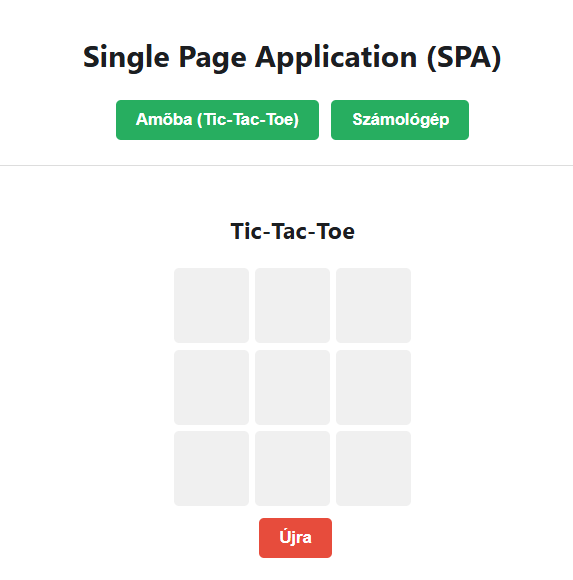
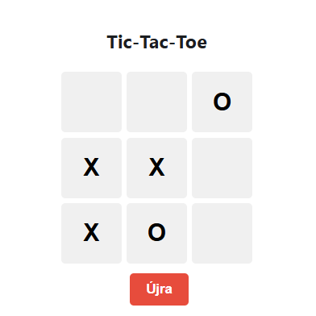
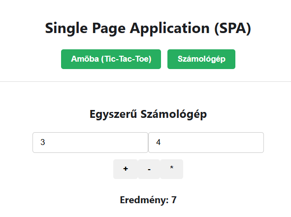

# 4. Single Page Application (SPA)

## 4.1 Feladat leírása

A Single Page Application (SPA) oldal bemutatja, hogyan lehet egy oldalon belül több különböző alkalmazást/játékot megjeleníteni anélkül, hogy az oldal újratöltődne. A navigáció React state segítségével történik.

## 4.2 Megvalósítás helye

- **Fájl:** `spa.html`, `src/SpaApp.jsx`, `src/spa_main.jsx`
- **Komponensek:** `src/components/TicTacToe.jsx`, `src/components/Calculator.jsx`
- **Elérhető URL:** http://liunjtm3bhzp.nhely.hu/spa.html

## 4.3 SPA projekt struktúra

```
src/
├── SpaApp.jsx                 # SPA fő komponens
├── spa_main.jsx               # SPA belépési pont
└── components/
    ├── TicTacToe.jsx          # Tic-Tac-Toe játék
    └── Calculator.jsx          # Számológép alkalmazás
```

## 4.4 Fő SPA Komponens

### 4.4.1 SpaApp.jsx

```jsx
import React, { useState } from "react";
import TicTacToe from "./components/TicTacToe";
import Calculator from "./components/Calculator";

function SpaApp() {
    const [page, setPage] = useState("tictactoe");

    return (
        <main>
            <div className="card">
                <h2>Single Page Application (SPA)</h2>
                <div style={{ marginBottom: "20px" }}>
                    <button
                        className="add"
                        onClick={() => setPage("tictactoe")}
                    >
                        Amőba (Tic-Tac-Toe)
                    </button>
                    <button 
                        className="add" 
                        onClick={() => setPage("calculator")}
                    >
                        Számológép
                    </button>
                </div>

                <div className="game-container">
                    {page === "tictactoe" ? <TicTacToe /> : <Calculator />}
                </div>
            </div>
        </main>
    );
}
```

**SPA működési elve:**
- A `page` state tárolja az aktuális nézetet
- A gombok frissítik a state-et
- Feltételes renderelés dönti el, melyik komponens jelenjen meg
- Az oldal **nem töltődik újra** a váltáskor

## 4.5 Tic-Tac-Toe Játék

### 4.5.1 Játék logika

```jsx
function TicTacToe() {
    const [board, setBoard] = useState(Array(9).fill(null));
    const [xIsNext, setXIsNext] = useState(true);

    const handleClick = (i) => {
        if (board[i]) return; // Ha már van érték, nem lehet kattintani
        const nextBoard = board.slice();
        nextBoard[i] = xIsNext ? "X" : "O";
        setBoard(nextBoard);
        setXIsNext(!xIsNext);
    };
    // ...
}
```

### 4.5.2 Játéktábla renderelése

```jsx
<div style={{
    display: "grid",
    gridTemplateColumns: "repeat(3, 60px)",
    gap: "5px",
    justifyContent: "center",
}}>
    {board.map((val, i) => (
        <button
            key={i}
            onClick={() => handleClick(i)}
            style={{ height: "60px", fontSize: "24px" }}
        >
            {val}
        </button>
    ))}
</div>
```

### 4.5.3 Újrakezdés funkció

```jsx
<button
    className="delete"
    onClick={() => setBoard(Array(9).fill(null))}
>
    Újra
</button>
```

## 4.6 Számológép Alkalmazás

### 4.6.1 Komponens kód

```jsx
function Calculator() {
    const [num1, setNum1] = useState(0);
    const [num2, setNum2] = useState(0);
    const [result, setResult] = useState(0);

    return (
        <div>
            <h3>Egyszerű Számológép</h3>
            <input
                type="number"
                value={num1}
                onChange={(e) => setNum1(Number(e.target.value))}
            />
            <input
                type="number"
                value={num2}
                onChange={(e) => setNum2(Number(e.target.value))}
            />
            <div>
                <button onClick={() => setResult(num1 + num2)}>+</button>
                <button onClick={() => setResult(num1 - num2)}>-</button>
                <button onClick={() => setResult(num1 * num2)}>*</button>
            </div>
            <h4>Eredmény: {result}</h4>
        </div>
    );
}
```

### 4.6.2 Funkciók

| Gomb | Művelet |
|------|---------|
| + | Összeadás |
| - | Kivonás |
| * | Szorzás |

## 4.7 Képernyőképek

### 4.7.1 SPA főoldal - Tic-Tac-Toe



### 4.7.2 Tic-Tac-Toe játék közben



### 4.7.3 Számológép nézet



## 4.8 SPA előnyei

| Előny | Leírás |
|-------|--------|
| Gyors navigáció | Nincs teljes oldal újratöltés |
| Jobb UX | Azonnali reakció a felhasználói interakciókra |
| State megőrzés | Az alkalmazás állapota megmarad navigálás közben |
| Kevesebb szerverterhelés | Csak az adatok töltődnek, nem a teljes HTML |

---

[← React CRUD](03-react-crud.md) | [Vissza a főoldalra](../README.md) | [Következő: Fetch API →](05-fetchapi.md)
