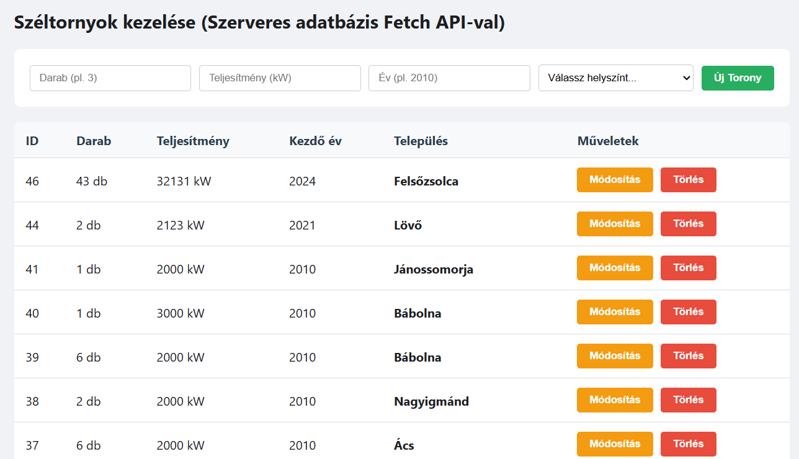
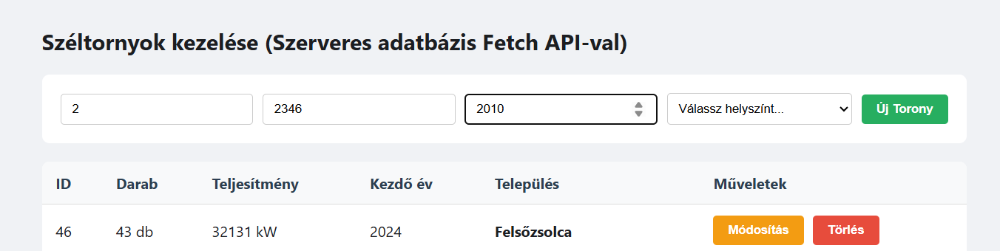
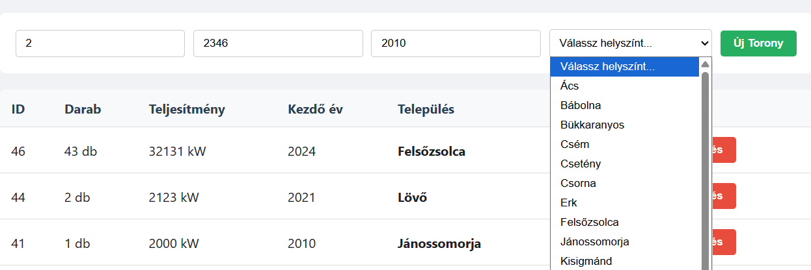
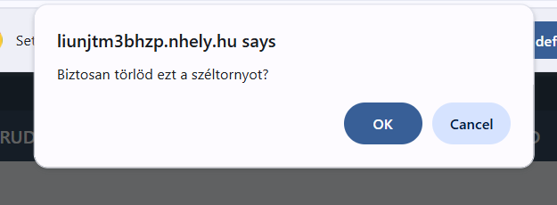
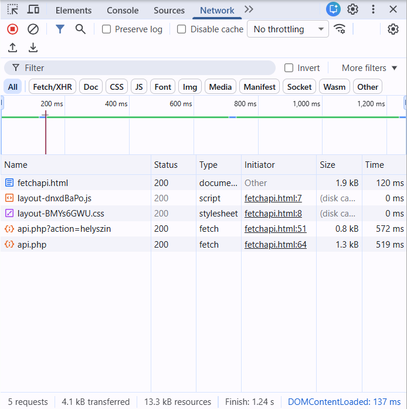

# 5. Fetch API (Szerveres CRUD)

## 5.1 Feladat leírása

Ez az oldal valódi szerveroldali adatkezelést valósít meg a JavaScript Fetch API segítségével. Az adatok MySQL adatbázisban tárolódnak és PHP REST API-n keresztül érhetők el.

## 5.2 Megvalósítás helye

- **Frontend fájl:** `fetchapi.html`
- **Backend API:** `backend/api.php`
- **Elérhető URL:** http://liunjtm3bhzp.nhely.hu/fetchapi.html
- **API végpont:** http://liunjtm3bhzp.nhely.hu/backend/api.php

## 5.3 API konfiguráció

```javascript
const API_URL = 'http://liunjtm3bhzp.nhely.hu/backend/api.php';
```

## 5.4 Adatbázis séma

A `torony` tábla szerkezete:

| Oszlop | Típus | Leírás |
|--------|-------|--------|
| id | INT (PK) | Egyedi azonosító |
| darab | INT | Tornyok száma |
| teljesitmeny | INT | Teljesítmény kW-ban |
| kezdev | INT | Üzembe helyezés éve |
| helyszinid | INT (FK) | Kapcsolat a helyszín táblához |

A `helyszin` tábla szerkezete:

| Oszlop | Típus | Leírás |
|--------|-------|--------|
| id | INT (PK) | Egyedi azonosító |
| nev | VARCHAR | Település neve |

## 5.5 CRUD Műveletek

### 5.5.1 Read - GET kérés (Lista betöltése)

```javascript
async function betoltes() {
    const valasz = await fetch(API_URL);
    const adatok = await valasz.json();

    const tbody = document.getElementById('lista');
    tbody.innerHTML = adatok.map(t => `
        <tr>
            <td>${t.id}</td>
            <td>${t.darab} db</td>
            <td>${t.teljesitmeny} kW</td>
            <td>${t.kezdev}</td>
            <td><strong>${t.telepules_nev}</strong></td>
            <td>
                <button class="edit" onclick="szerkeszt(...)">Módosítás</button>
                <button class="delete" onclick="torol(${t.id})">Törlés</button>
            </td>
        </tr>
    `).join('');
}
```

### 5.5.2 Helyszínek lekérése (SELECT dropdown)

```javascript
async function init() {
    const valaszHely = await fetch(API_URL + '?action=helyszin');
    helyszinekListaja = await valaszHely.json();

    const select = document.getElementById('tHelyszin');
    helyszinekListaja.forEach(h => {
        select.innerHTML += `<option value="${h.id}">${h.nev}</option>`;
    });
    
    betoltes();
}
```

### 5.5.3 Create - POST kérés (Új torony)

```javascript
async function hozzaad() {
    const darab = document.getElementById('tDarab').value;
    const telj = document.getElementById('tTelj').value;
    const ev = document.getElementById('tEv').value;
    const hely = document.getElementById('tHelyszin').value;

    if (!darab || !telj || !ev || !hely) return alert("Minden mezőt ki kell tölteni!");

    await fetch(API_URL, {
        method: 'POST',
        headers: {'Content-Type': 'application/json'},
        body: JSON.stringify({
            darab: darab, 
            teljesitmeny: telj, 
            kezdev: ev, 
            helyszinid: hely
        })
    });

    betoltes(); // Újratöltés
}
```

### 5.5.4 Update - PUT kérés (Módosítás)

```javascript
async function szerkeszt(id, regiDarab, regiTelj, regiEv, regiHely) {
    const ujDarab = prompt("Új darabszám:", regiDarab);
    const ujTelj = prompt("Új teljesítmény (kW):", regiTelj);
    const ujEv = prompt("Új kezdő év:", regiEv);
    const ujHely = prompt("Új Helyszín ID:", regiHely);

    if (ujDarab && ujTelj && ujEv && ujHely) {
        await fetch(API_URL, {
            method: 'PUT',
            headers: {'Content-Type': 'application/json'},
            body: JSON.stringify({
                id: id, 
                darab: ujDarab, 
                teljesitmeny: ujTelj, 
                kezdev: ujEv, 
                helyszinid: ujHely
            })
        });
        betoltes();
    }
}
```

### 5.5.5 Delete - DELETE kérés (Törlés)

```javascript
async function torol(id) {
    if (confirm("Biztosan törlöd ezt a széltornyot?")) {
        await fetch(API_URL, {
            method: 'DELETE',
            headers: {'Content-Type': 'application/json'},
            body: JSON.stringify({id: id})
        });
        betoltes();
    }
}
```

## 5.6 Fetch API vs egyéb megoldások

| Aspektus | Fetch API | XMLHttpRequest | Axios |
|----------|-----------|----------------|-------|
| Szintaxis | Modern, Promise-alapú | Callback alapú | Promise + extra funkciók |
| Beépített | Igen (böngésző) | Igen (böngésző) | Nem (npm csomag) |
| JSON kezelés | Manuális `.json()` | Manuális | Automatikus |
| Hibakezelés | catch() | onerror | try/catch |

## 5.7 Képernyőképek

### 5.7.1 Fetch API CRUD oldal



### 5.7.2 Új széltorony hozzáadása



### 5.7.3 Helyszín kiválasztása (dropdown)



### 5.7.4 Törlés megerősítés



### 5.7.5 DevTools Network nézet



## 5.8 Input mezők

| Mező | Típus | Validáció | Leírás |
|------|-------|-----------|--------|
| Darab | `<input type="number">` | Kötelező | Tornyok száma |
| Teljesítmény | `<input type="number">` | Kötelező | kW-ban megadva |
| Év | `<input type="number">` | Kötelező | Üzembe helyezés éve |
| Helyszín | `<select>` | Kötelező | Dinamikusan töltődik az adatbázisból |

---

[← SPA](04-spa.md) | [Vissza a főoldalra](../README.md) | [Következő: Backend →](06-backend.md)
