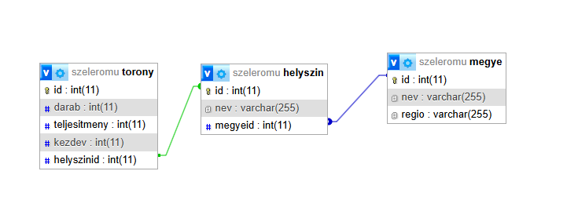
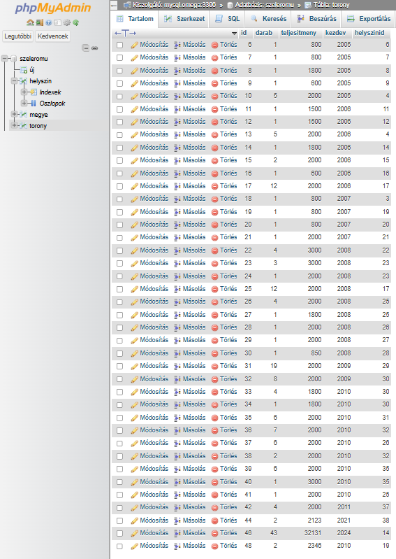
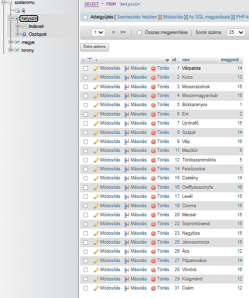
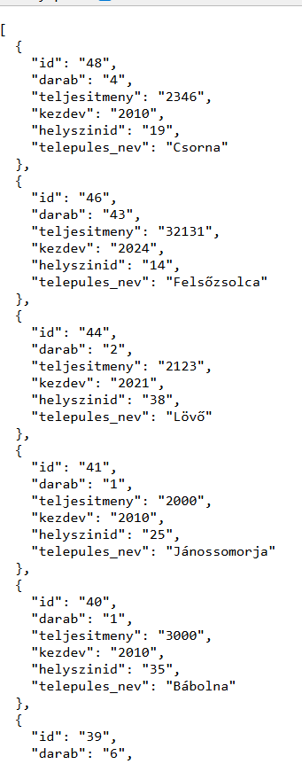

# 6. Backend és Adatbázis

## 6.1 Feladat leírása

A backend PHP nyelven íródott és REST API-ként szolgál a frontend számára. Az adatok MySQL adatbázisban tárolódnak, PDO kapcsolaton keresztül érhetők el.

## 6.2 Fájlok és elérési utak

| Fájl | Cél |
|------|-----|
| `backend/api.php` | REST API végpontok |
| `backend/config.php` | Adatbázis konfiguráció |
| `backend/db.php` | PDO kapcsolat létrehozása |

## 6.3 API Endpoint

**Alap URL:** `http://liunjtm3bhzp.nhely.hu/backend/api.php`

## 6.4 REST API Műveletek

### 6.4.1 CORS Beállítások

```php
header("Access-Control-Allow-Origin: *");
header("Access-Control-Allow-Methods: GET, POST, PUT, DELETE, OPTIONS");
header("Access-Control-Allow-Headers: Content-Type");
header("Content-Type: application/json; charset=utf-8");
```

### 6.4.2 GET - Adatok lekérdezése

**Tornyok listázása:**
```
GET /backend/api.php
```

```php
$sql = "SELECT t.id, t.darab, t.teljesitmeny, t.kezdev, t.helyszinid, 
               h.nev AS telepules_nev 
        FROM torony t 
        JOIN helyszin h ON t.helyszinid = h.id 
        ORDER BY t.id DESC";
$stmt = $dbh->query($sql);
echo json_encode($stmt->fetchAll(PDO::FETCH_ASSOC));
```

**Helyszínek listázása:**
```
GET /backend/api.php?action=helyszin
```

```php
$stmt = $dbh->query("SELECT id, nev FROM helyszin ORDER BY nev");
echo json_encode($stmt->fetchAll(PDO::FETCH_ASSOC));
```

### 6.4.3 POST - Új rekord létrehozása

```
POST /backend/api.php
Content-Type: application/json

{
    "darab": 3,
    "teljesitmeny": 2500,
    "kezdev": 2020,
    "helyszinid": 1
}
```

```php
$stmt = $dbh->prepare("INSERT INTO torony (darab, teljesitmeny, kezdev, helyszinid) 
                       VALUES (:darab, :teljesitmeny, :kezdev, :helyszinid)");
$stmt->execute([
    'darab' => $input['darab'], 
    'teljesitmeny' => $input['teljesitmeny'], 
    'kezdev' => $input['kezdev'], 
    'helyszinid' => $input['helyszinid']
]);
echo json_encode(['üzenet' => 'Sikeres hozzáadás']);
```

### 6.4.4 PUT - Rekord módosítása

```
PUT /backend/api.php
Content-Type: application/json

{
    "id": 1,
    "darab": 5,
    "teljesitmeny": 3000,
    "kezdev": 2021,
    "helyszinid": 2
}
```

```php
$stmt = $dbh->prepare("UPDATE torony 
                       SET darab=:darab, teljesitmeny=:teljesitmeny, 
                           kezdev=:kezdev, helyszinid=:helyszinid 
                       WHERE id=:id");
$stmt->execute([/* ... */]);
echo json_encode(['üzenet' => 'Sikeres módosítás']);
```

### 6.4.5 DELETE - Rekord törlése

```
DELETE /backend/api.php
Content-Type: application/json

{"id": 1}
```

```php
$stmt = $dbh->prepare("DELETE FROM torony WHERE id=:id");
$stmt->execute(['id' => $input['id']]);
echo json_encode(['üzenet' => 'Sikeres törlés']);
```

## 6.5 Adatbázis konfiguráció

### 6.5.1 config.php

```php
<?php
define('DB_HOST', 'localhost');
define('DB_NAME', 'szeleromu');
define('DB_USER', 'szeleromu');
define('DB_PASS', '********');
?>
```

### 6.5.2 db.php - PDO kapcsolat

```php
<?php
require_once 'config.php';

try {
    $dbh = new PDO(
        "mysql:host=" . DB_HOST . ";dbname=" . DB_NAME . ";charset=utf8",
        DB_USER,
        DB_PASS,
        array(PDO::ATTR_ERRMODE => PDO::ERRMODE_EXCEPTION)
    );
} catch (PDOException $e) {
    http_response_code(500);
    die(json_encode(['hiba' => 'Kapcsolódási hiba történt']));
}
?>
```

## 6.6 Adatbázis struktúra

### 6.6.1 ER Diagram

```
┌─────────────┐       ┌─────────────┐
│  helyszin   │       │   torony    │
├─────────────┤       ├─────────────┤
│ id (PK)     │◄──────│ id (PK)     │
│ nev         │   1:N │ darab       │
└─────────────┘       │ teljesitmeny│
                      │ kezdev      │
                      │ helyszinid  │──► FK
                      └─────────────┘
```

### 6.6.2 Táblák létrehozása (SQL)

```sql
CREATE TABLE helyszin (
    id INT AUTO_INCREMENT PRIMARY KEY,
    nev VARCHAR(100) NOT NULL
);

CREATE TABLE torony (
    id INT AUTO_INCREMENT PRIMARY KEY,
    darab INT NOT NULL,
    teljesitmeny INT NOT NULL,
    kezdev INT NOT NULL,
    helyszinid INT NOT NULL,
    FOREIGN KEY (helyszinid) REFERENCES helyszin(id)
);
```

## 6.7 Hibakezelés

A backend minden esetben JSON formátumban ad vissza hibát:

```php
try {
    // ... műveletek
} catch (PDOException $e) {
    http_response_code(500);
    echo json_encode(['hiba' => $e->getMessage()]);
}
```

## 6.8 Képernyőképek

### 6.8.1 phpMyAdmin - Adatbázis struktúra



### 6.8.2 phpMyAdmin - Torony tábla adatai



### 6.8.3 phpMyAdmin - Helyszín tábla adatai



### 6.8.4 API válasz a böngészőben



## 6.9 Biztonsági megfontolások

| Elem | Megvalósítás |
|------|--------------|
| SQL Injection | PDO prepared statements használata |
| CORS | Access-Control-Allow-Origin header |
| Input validáció | Frontend és backend oldalon is |
| Hibakezelés | Try-catch blokkok, strukturált hibaüzenetek |

---

[← Fetch API](05-fetchapi.md) | [Vissza a főoldalra](../README.md) | [Következő: Axios →](08-axios.md)
