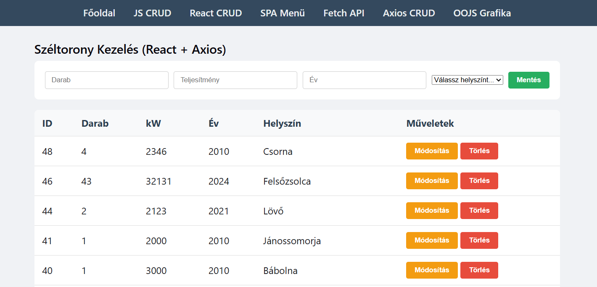
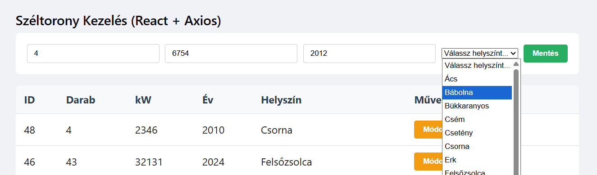
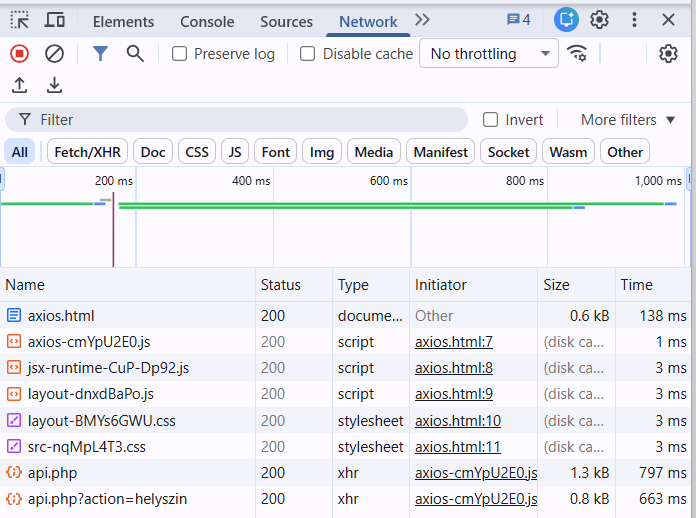

# 8. Axios CRUD (React + Axios)

## 8.1 Feladat leírása

Ez az oldal a React és Axios kombinációjával valósít meg szerveres CRUD műveleteket. Az Axios egy népszerű HTTP kliens könyvtár, amely egyszerűbb szintaxist és automatikus JSON kezelést biztosít a natív Fetch API-hoz képest.

## 8.2 Megvalósítás helye

- **Fájl:** `axios.html`, `src/AxiosApp.jsx`, `src/axios_main.jsx`
- **Elérhető URL:** http://liunjtm3bhzp.nhely.hu/axios.html

## 8.3 Axios vs Fetch API összehasonlítás

| Tulajdonság | Fetch API | Axios |
|-------------|-----------|-------|
| Beépített | Igen (böngésző) | Nem (npm csomag) |
| JSON kezelés | Manuális `.json()` | Automatikus |
| Hibakezelés | Manuális status check | Automatikus HTTP hibák |
| Request/Response interceptors | Nincs | Van |
| Timeout kezelés | AbortController | Beépített |
| Régebbi böngészők | Polyfill kell | Támogatott |

## 8.4 Axios telepítése

```bash
npm install axios
```

## 8.5 Komponens struktúra

### 8.5.1 axios_main.jsx (Belépési pont)

```jsx
import { StrictMode } from 'react'
import { createRoot } from 'react-dom/client'
import './index.css'
import AxiosApp from './AxiosApp.jsx'

createRoot(document.getElementById('axios-root')).render(
  <StrictMode>
    <AxiosApp />
  </StrictMode>,
)
```

### 8.5.2 AxiosApp.jsx (Fő komponens)

```jsx
import React, { useState, useEffect } from "react";
import axios from "axios";

function AxiosApp() {
  const API_URL = "http://liunjtm3bhzp.nhely.hu/backend/api.php";

  const [tornyok, setTornyok] = useState([]);
  const [helyszinek, setHelyszinek] = useState([]);
  const [formData, setFormData] = useState({
    darab: "",
    teljesitmeny: "",
    kezdev: "",
    helyszinid: "",
  });
  // ...
}
```

## 8.6 CRUD Műveletek Axios-szal

### 8.6.1 READ - Adatok betöltése (GET)

```jsx
useEffect(() => {
    betoltAdatok();
    betoltHelyszinek();
}, []);

const betoltAdatok = async () => {
    try {
        const response = await axios.get(API_URL);
        setTornyok(response.data);  // Automatikus JSON parse!
    } catch (error) {
        console.error("Hiba a tornyok betöltésekor:", error);
    }
};

const betoltHelyszinek = async () => {
    try {
        const response = await axios.get(`${API_URL}?action=helyszin`);
        setHelyszinek(response.data);
    } catch (error) {
        console.error("Hiba a helyszínek betöltésekor:", error);
    }
};
```

**Axios előny:** Nem kell `.json()` metódust hívni, az `response.data` már a parse-olt objektum.

### 8.6.2 CREATE - Új rekord (POST)

```jsx
const hozzaad = async () => {
    if (!formData.darab || !formData.helyszinid)
        return alert("Töltsd ki a mezőket!");
    try {
        await axios.post(API_URL, formData);
        setFormData({ darab: "", teljesitmeny: "", kezdev: "", helyszinid: "" });
        betoltAdatok();
    } catch (error) {
        alert("Sikertelen mentés!");
    }
};
```

**Axios előny:** Automatikusan beállítja a `Content-Type: application/json` headert.

### 8.6.3 UPDATE - Módosítás (PUT)

```jsx
const modosit = async (t) => {
    const ujDarab = prompt("Új darabszám:", t.darab);
    if (ujDarab) {
        try {
            await axios.put(API_URL, { ...t, darab: ujDarab });
            betoltAdatok();
        } catch (error) {
            alert("Hiba a módosításnál!");
        }
    }
};
```

### 8.6.4 DELETE - Törlés

```jsx
const torol = async (id) => {
    if (!window.confirm("Biztosan törlöd?")) return;
    try {
        await axios.delete(API_URL, { data: { id: id } });
        betoltAdatok();
    } catch (error) {
        alert("Hiba a törlésnél!");
    }
};
```

**Megjegyzés:** DELETE kérésnél a body-t a `data` property-ben kell megadni.

## 8.7 State kezelés formhoz

```jsx
const [formData, setFormData] = useState({
    darab: "",
    teljesitmeny: "",
    kezdev: "",
    helyszinid: "",
});

// Input kezelés spread operátorral
<input
    type="number"
    placeholder="Darab"
    value={formData.darab}
    onChange={(e) => setFormData({ ...formData, darab: e.target.value })}
/>
```

## 8.8 useEffect Hook

A `useEffect` hook biztosítja, hogy az adatok betöltődjenek a komponens mountolásakor:

```jsx
useEffect(() => {
    betoltAdatok();
    betoltHelyszinek();
}, []);  // Üres dependency array = csak egyszer fut le
```

## 8.9 Képernyőképek

### 8.9.1 Axios CRUD oldal



### 8.9.2 Űrlap kitöltése



### 8.9.3 DevTools Network - Axios kérés



## 8.10 Hibakezelés

Az Axios automatikusan dob hibát, ha a HTTP státuszkód 4xx vagy 5xx:

```jsx
try {
    await axios.post(API_URL, formData);
} catch (error) {
    if (error.response) {
        // Szerver válaszolt, de hibaállapottal
        console.log("Hiba:", error.response.status);
        console.log("Üzenet:", error.response.data);
    } else if (error.request) {
        // Kérés elküldve, de nem jött válasz
        console.log("Nincs válasz a szervertől");
    } else {
        // Valami más hiba
        console.log("Hiba:", error.message);
    }
}
```

---

[← Technikai adatok](07-technikai-adatok.md) | [Vissza a főoldalra](../README.md) | [Következő: OOJS →](09-oojs.md)
