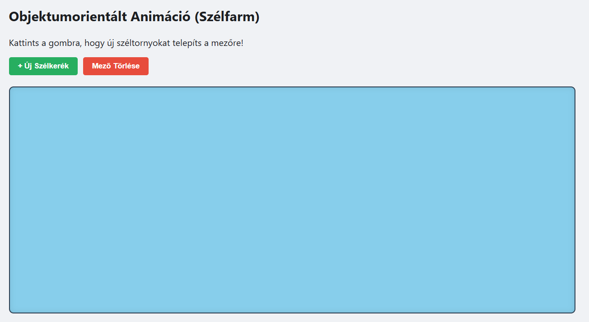
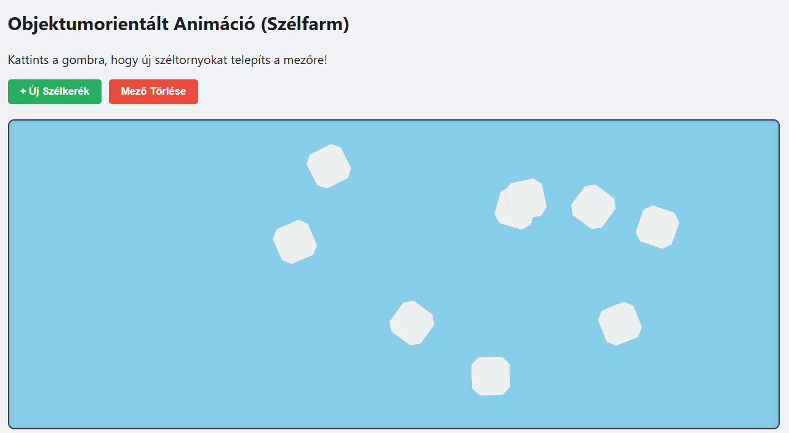

# 9. Objektumorientált JavaScript (OOJS) - Animált Szélfarm

## 9.1 Feladat leírása

Ez az oldal objektumorientált JavaScript programozást mutat be egy animált szélfarm vizualizációval. A megoldás ES6 osztályokat (class) használ öröklődéssel és polimorfizmussal.

## 9.2 Megvalósítás helye

- **Fájl:** `oojs.html`
- **Elérhető URL:** http://liunjtm3bhzp.nhely.hu/oojs.html

## 9.3 OOP alapfogalmak a megvalósításban

| OOP koncepció | Megvalósítás |
|---------------|--------------|
| **Osztály (Class)** | `Alakzat`, `Szelkerek` |
| **Öröklődés (Inheritance)** | `Szelkerek extends Alakzat` |
| **Konstruktor** | `constructor(x, y, meret, szin)` |
| **Tulajdonságok** | `this.x`, `this.y`, `this.elem` |
| **Metódusok** | `megjelenit()`, `forgat()` |
| **super() hívás** | Szülő konstruktor meghívása |

## 9.4 Osztályok

### 9.4.1 Alakzat (Szülő osztály)

```javascript
class Alakzat {
    constructor(x, y, meret, szin) {
        this.x = x;
        this.y = y;
        this.meret = meret;

        // DOM elem létrehozása
        this.elem = document.createElement('div');
        this.elem.style.position = 'absolute';
        this.elem.style.left = this.x + 'px';
        this.elem.style.top = this.y + 'px';
        this.elem.style.width = this.meret + 'px';
        this.elem.style.height = this.meret + 'px';
        this.elem.style.backgroundColor = szin;
    }

    megjelenit(szuloElem) {
        if (szuloElem) {
            szuloElem.appendChild(this.elem);
        } else {
            document.body.appendChild(this.elem);
        }
    }
}
```

**Az Alakzat osztály:**
- Alap tulajdonságokat definiál (x, y pozíció, méret)
- Létrehozza a DOM elemet a konstruktorban
- `megjelenit()` metódussal hozzáadja a DOM-hoz

### 9.4.2 Szelkerek (Gyermek osztály)

```javascript
class Szelkerek extends Alakzat {
    constructor(x, y, meret, sebesseg) {
        // Szülő konstruktor meghívása
        super(x, y, meret, '#ecf0f1');

        this.sebesseg = sebesseg;  // Forgási sebesség
        this.szog = 0;             // Aktuális szög

        // Szélkerék megjelenés (nyolcszög)
        this.elem.style.clipPath = 'polygon(20% 0%, 80% 0%, 100% 20%, 100% 80%, 80% 100%, 20% 100%, 0% 80%, 0% 20%)';
        this.elem.style.boxShadow = "0 0 5px rgba(0,0,0,0.5)";
    }

    forgat() {
        this.szog += this.sebesseg;
        this.elem.style.transform = `rotate(${this.szog}deg)`;
    }
}
```

**A Szelkerek osztály:**
- Kiterjeszti az `Alakzat` osztályt (`extends`)
- `super()` hívással inicializálja a szülő tulajdonságokat
- Új tulajdonságok: `sebesseg`, `szog`
- Új metódus: `forgat()` - animációhoz

## 9.5 Animáció megvalósítása

### 9.5.1 requestAnimationFrame használata

```javascript
const rajzlap = document.getElementById('rajzlap');
const kerekek = [];  // Szélkerekek tömbje

function animacio() {
    // Minden szélkereket forgatunk
    kerekek.forEach(kerek => kerek.forgat());
    
    // Következő frame kérése
    requestAnimationFrame(animacio);
}

// Animáció indítása
animacio();
```

**requestAnimationFrame előnyei:**
- ~60 FPS (böngésző optimalizált)
- Automatikusan szünetel, ha a tab nem aktív
- Jobb teljesítmény, mint setInterval

### 9.5.2 Új szélkerék hozzáadása

```javascript
function ujSzelkerek() {
    // Random pozíció a rajzlapon belül
    const x = Math.random() * (rajzlap.offsetWidth - 60);
    const y = Math.random() * (rajzlap.offsetHeight - 60);
    
    // Random forgási sebesség (1-6 fok/frame)
    const sebesseg = Math.random() * 5 + 1;

    // Új szélkerék példány létrehozása
    const kerek = new Szelkerek(x, y, 50, sebesseg);
    
    // Megjelenítés
    kerek.megjelenit(rajzlap);
    
    // Hozzáadás a tömbhöz (animációhoz)
    kerekek.push(kerek);
}
```

### 9.5.3 Törlés

```javascript
function torolMindent() {
    rajzlap.innerHTML = '';  // DOM elemek törlése
    kerekek.length = 0;      // Tömb ürítése
}
```

## 9.6 CSS a rajzlaphoz

```css
#rajzlap {
    position: relative;
    width: 100%;
    height: 400px;
    background-color: #87CEEB;  /* Égszínkék háttér */
    border: 2px solid #2c3e50;
    border-radius: 8px;
    overflow: hidden;
    margin-top: 20px;
    box-shadow: inset 0 0 10px rgba(0, 0, 0, 0.1);
}
```

## 9.7 Képernyőképek

### 9.7.1 OOJS Szélfarm üres állapot



### 9.7.2 Szélfarm több szélkerékkel




## 9.8 OOP előnyök ebben a projektben

| Előny | Leírás |
|-------|--------|
| **Újrafelhasználhatóság** | Bármennyi szélkerék példányosítható |
| **Encapsulation** | Minden szélkerék saját állapottal rendelkezik |
| **Könnyű bővíthetőség** | Új alakzat típusok könnyen hozzáadhatók |
| **Karbantarthatóság** | Logika szétválasztva osztályokba |

## 9.9 Lehetséges bővítések

```javascript
// Példa: Színes szélkerék osztály
class SzinesKerek extends Szelkerek {
    constructor(x, y, meret, sebesseg, szin) {
        super(x, y, meret, sebesseg);
        this.elem.style.backgroundColor = szin;
    }
}

// Példa: Nagyobb torony
class NagyTorony extends Szelkerek {
    constructor(x, y) {
        super(x, y, 100, 2);  // Fix nagy méret, lassabb forgás
    }
}
```

---

[← Axios](08-axios.md) | [Vissza a főoldalra](../README.md)
